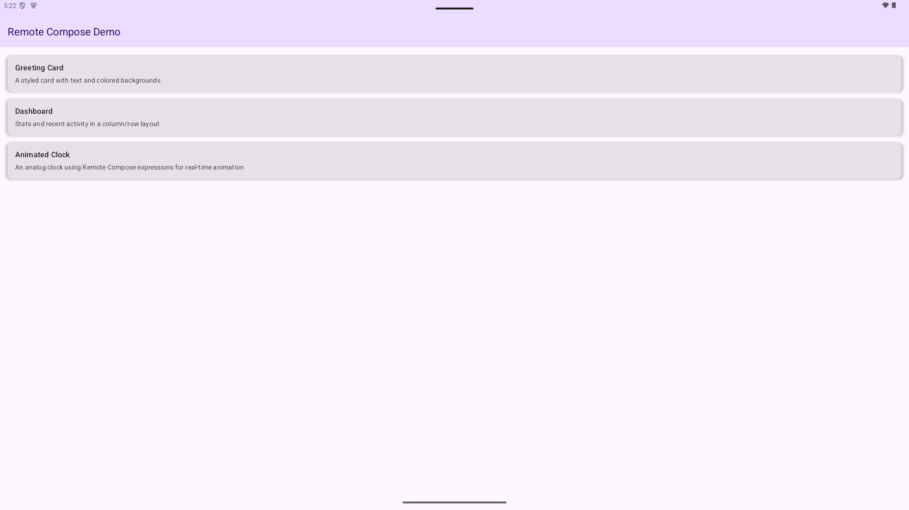
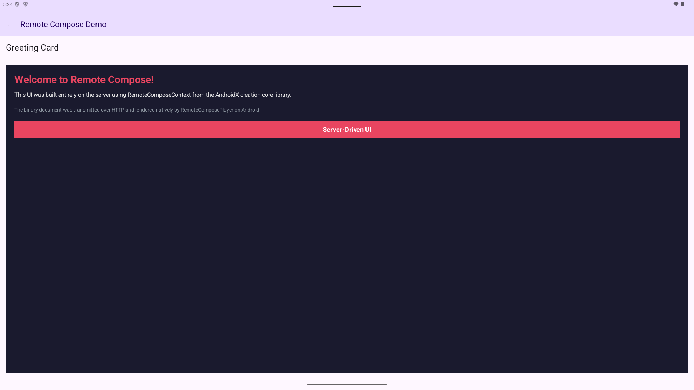

# Remote Compose Demo

A Gradle multimodule project
demonstrating [Android Remote Compose](https://developer.android.com/jetpack/androidx/releases/compose-remote)
with a Ktor server and an Android client.

The server builds binary Remote Compose documents on the JVM using `RemoteComposeContext` /
`RemoteComposeWriter` from the `androidx.compose.remote:remote-creation-*` libraries. The Android
app fetches these documents over HTTP and renders them natively using `RemoteDocumentPlayer` from
`androidx.compose.remote:remote-player-compose`.

## Screenshots

| Document catalog | Greeting Card rendered by RemoteDocumentPlayer |
|---|---|
|  |  |

## Modules

| Module    | Description                                                                                           |
|-----------|-------------------------------------------------------------------------------------------------------|
| `:shared` | Kotlin JVM library with shared models (`DocumentCatalog`, `DocumentInfo`) using kotlinx.serialization |
| `:server` | Ktor (Netty) server on port 8080 that serves Remote Compose binary documents                          |
| `:app`    | Android client that fetches and renders documents with `RemoteDocumentPlayer`                          |

## Example Documents

- **Greeting Card** — styled text in columns with colored backgrounds
- **Dashboard** — stat cards in a row + activity list using layout primitives (`column`, `row`,
  `box`, `text`)
- **Animated Clock** — analog clock with hour/minute/second hands driven by `Hour()`, `Minutes()`,
  `ContinuousSec()` expressions that animate on the client in real-time without server round-trips

## Running

### Prerequisites

- JDK 17+
- Android SDK (for the app module)

### 1. Start the server

```sh
./gradlew :server:run
```

The server starts at `http://localhost:8080`. You can verify with:

```sh
curl http://localhost:8080/api/catalog
```

### 2. Run the Android app

With the server running and an emulator started:

```sh
./gradlew :app:installDebug
```

The app connects to `10.0.2.2:8080` (the emulator's alias for the host machine's localhost).

### API Endpoints

| Method | Path                 | Response                                                    |
|--------|----------------------|-------------------------------------------------------------|
| GET    | `/api/catalog`       | JSON catalog of available documents                         |
| GET    | `/api/document/{id}` | Binary Remote Compose document (`application/octet-stream`) |

## Dependencies

- [AndroidX Remote Compose](https://developer.android.com/jetpack/androidx/releases/compose-remote)
  `1.0.0-alpha06`
- [Ktor](https://ktor.io/) `3.0.3`
- [Jetpack Compose](https://developer.android.com/develop/ui/compose) (via BOM)
